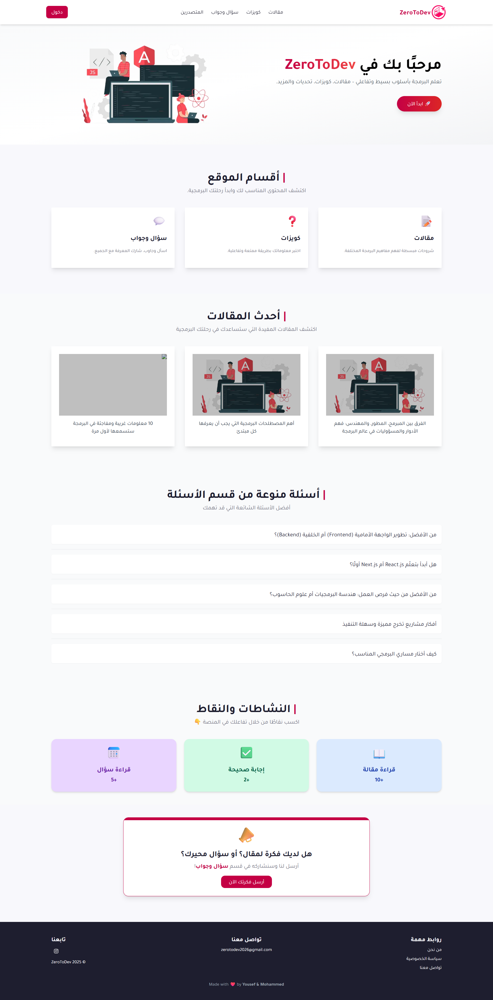
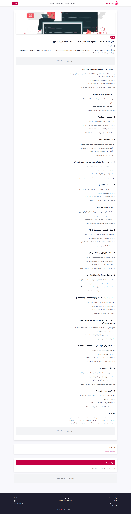
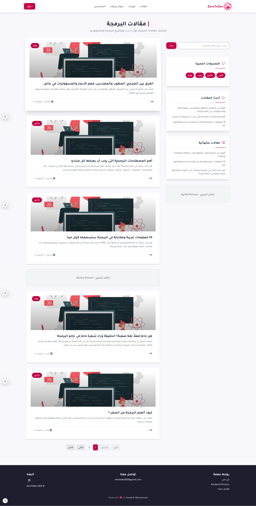
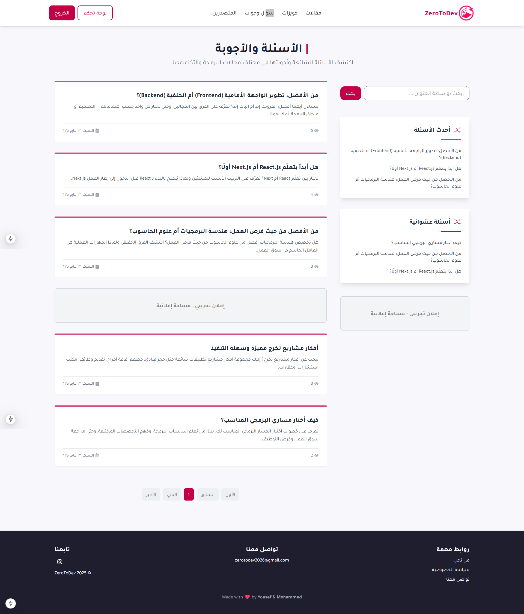
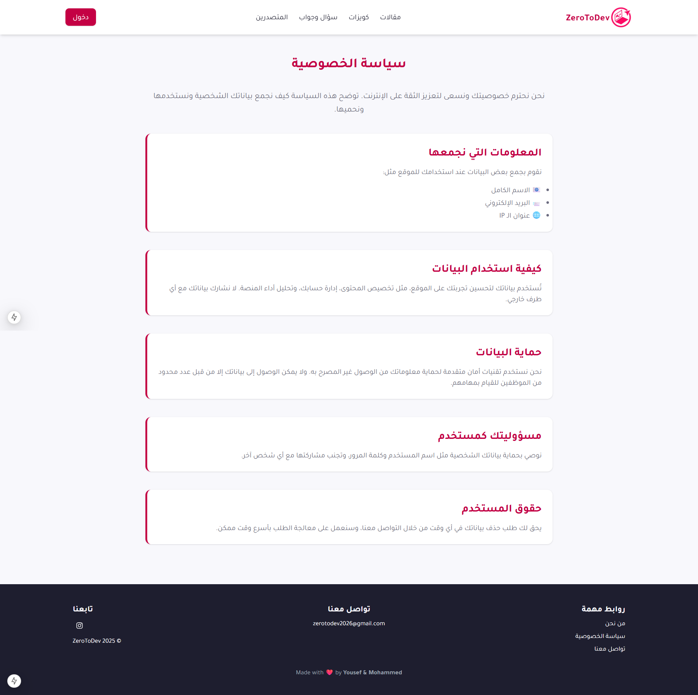
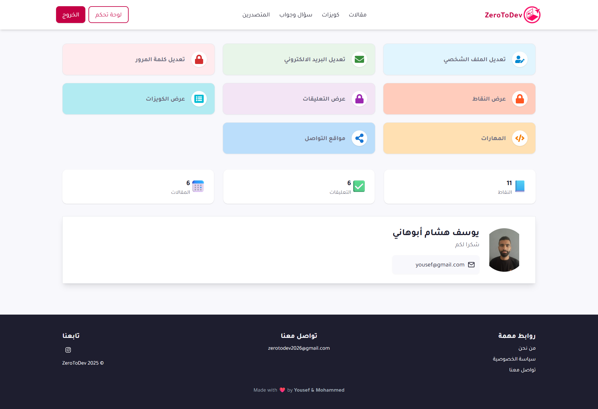
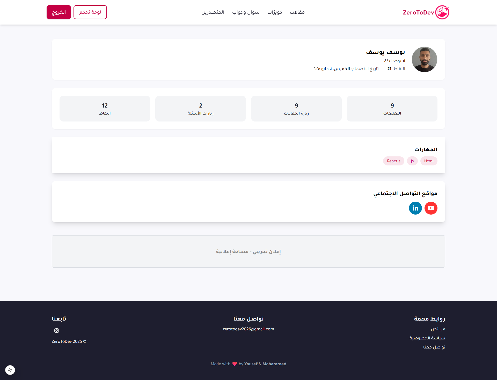
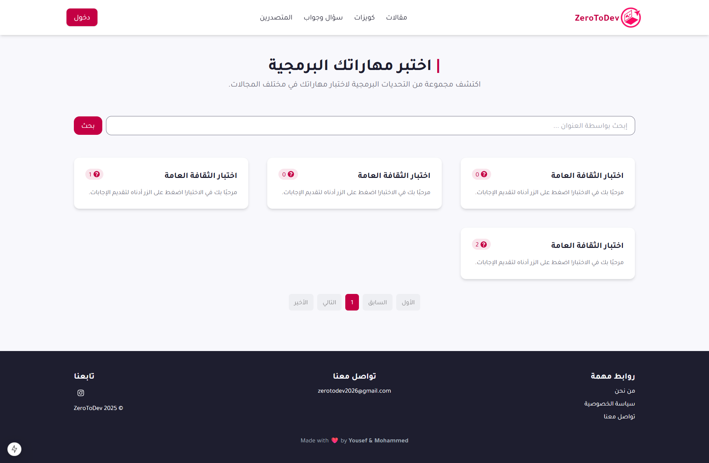

# Zerotodev - Educational Programming Platform

Zerotodev is an educational web platform designed to help users learn programming through interactive articles, quizzes, points, and gamified features.

## Articles Features
* Users can browse categorized programming articles
* Reading an article gives the user +1 point.
Supports pagination and sorting (most viewed, latest, random).

## Quizzes Features
* Users can solve quizzes to test their programming knowledge.
* Each correct answer gives +2 point.
* User quiz attempts and scores are saved.

## Questions Features
* Users can view and interact with programming-related questions.
* Each question supports answer
* Sidebar shows top and random questions

## User Profile
* Their name, profile image, and bio
* Their earned points and activity stats (articles, quizzes)

### Screenshots
Here are some screenshots from Store:

## Frontend Technologies and Skills
* **Next.js 15**: A React-based framework for building server-side rendered web applications with ease.
* **Tailwind CSS**: A utility-first CSS framework for rapid UI development.

## Backend Technologies and Skills
* **NestJS**: A progressive Node.js framework for building efficient and scalable server-side applications.
* **JWT (JSON Web Token)**: Used for secure authentication and authorization in the application.
* **Sequelize**: ORM for managing models and database operations.
